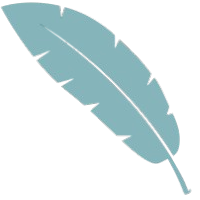

<div align="center" id="madewithlua">
  
</div>

<h1 align="center">FtVim</h1>

```
    (`/\    ███████╗████████╗██╗   ██╗██╗███╗   ███╗        
    `=\/\   ██╔════╝╚══██╔══╝██║   ██║██║████╗ ████║        
     `=\/\  █████╗     ██║   ██║   ██║██║██╔████╔██║        
      `=\/  ██╔══╝     ██║   ╚██╗ ██╔╝██║██║╚██╔╝██║        
         \  ██║        ██║    ╚████╔╝ ██║██║ ╚═╝ ██║
            ╚═╝        ╚═╝     ╚═══╝  ╚═╝╚═╝     ╚═╝     
```

<p align="center">
    <a href="https://github.com/FtVim/FtVim/stargazers">
      
    </a>
</p>

<p align="center">
Ftvim is an neovim config that is extensible and easy to use with a great set of plugins
</p>
